# Pimcore Brand and Asset Portal

Pimcore Asset Portal is an image library for marketing teams. It offers an alternative 
view – especially for marketing teams and clients – on all assets managed in Pimcore.

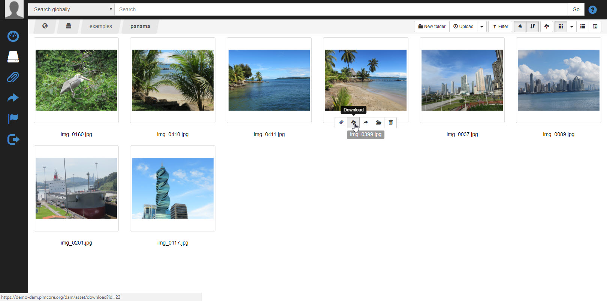

It is accessible via `http(s)://YOUDOMAIN/dam` and supports:
- Login / Permissions for asset folders
- Organization of assets
- Searching assets (full-text search incl. asset metadata, properties etc.)
- Adding assets to collections and download those
- Sharing assets and collections
- Uploading / Editing assets (if permitted to user)
- Extending main menu with additional items to implement custom features

## Demo
For a first impression, use the following demo installation. 

[https://demo-dam.pimcore.org/dam/login](https://demo-dam.pimcore.org/dam/login)

User: `dam-admin` | Password: `demo`

> Notice: This demo gets reset on regular basis. 


## Installation

### Composer

To get the plugin code you have to [buy the plugin](https://shop.blackbit.com/pimcore-plugin-digital-asset-management-dam/) or write an email to [info@blackbit.de](mailto:info@blackbit.de).

You then either get access to the bundle's [Bitbucket repository](https://bitbucket.org/blackbitwerbung/pimcore-plugins-dam) or you get the plugin code as a zip file. Accessing the Bitbucket repository has the advantage that you will always see changes to the plugin in the pull requests and are able to update to a new version yourself - please visit [this page](https://shop.blackbit.de/de/service-xt-commerce/bitbucket-zugriff-xt-commerce-plugin-entwicklung) if this sounds interesting to you - if it does, please send us the email address of your BitBucket account so we can allow access to the repository.

When we allow your account to access our repository, please add the repository to the `composer.json` in your Pimcore root folder (see [Composer repositories](https://getcomposer.org/doc/05-repositories.md#vcs)):

```json
"repositories": [
    {
        "type": "vcs",
        "url": "git@bitbucket.org:blackbitwerbung/pimcore-plugins-dam"
    }
],
```

(Please [add your public SSH key to your Bitbucket account](https://support.atlassian.com/bitbucket-cloud/docs/add-access-keys/#Step-3.-Add-the-public-key-to-your-repository) for this to work)

Alternatively if you received the plugin code as zip file, please upload the zip file to your server - e.g. create a folder `bundles` in the Pimcore root folder) and add the following to your `composer.json`:

```json
"repositories": [
    {
        "type": "artifact",
        "url": "./bundles/"
    }
]
```

Beware that when you put the zip directly in the Pimcore root folder, and add `"url": "./"` it will still work but Composer will scan *all* files under the Pimcore root recursively to find bundle zip files (incl. assets, versions etc) - which will take quite a long time.

Then you should be able to execute `composer require blackbit/asset-portal` (or `composer update blackbit/asset-portal --with-dependencies` for updates if you already have this bundle installed) from CLI.

At last you have to enable and install the plugin, either via browser UI or via CLI `bin/console pimcore:bundle:enable BlackbitAssetPortalBundle && bin/console pimcore:bundle:install BlackbitAssetPortalBundle`

You can always access the latest version by executing `composer update blackbit/asset-portal --with-dependencies` on CLI.

## Portal usage

### Asset Listing {#asset-listing}


The asset listing is the main navigation interface of the Asset portal. It lists the content (asset and folders) of a certain folder, allows navigation along the folder structure and provides several additional features that are listed below.

#### Filtering

Filters allow to set up a filtered view. To activate the filter sidebar use the filter button in the toolbar at the top.

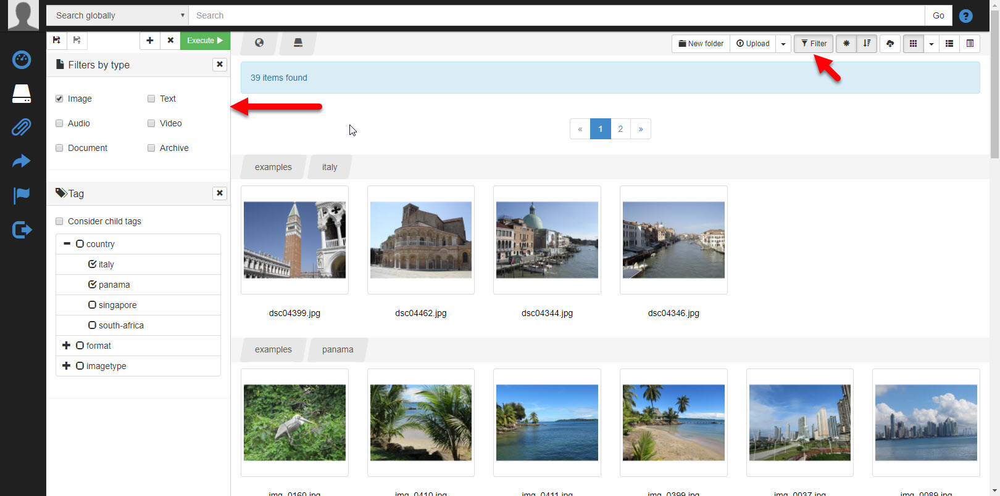

Once activated, filters can be added, removed and configured. After changing filter criteria, the execute button (it turns green if any filter setting was changed) has to be clicked to apply the filter criteria.

The filter result shows all assets of all folders that meet the filter criteria and groups them by folders.

Filters can be saved for later use. The filter overview allows renaming, applying and deleting filters.

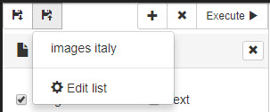
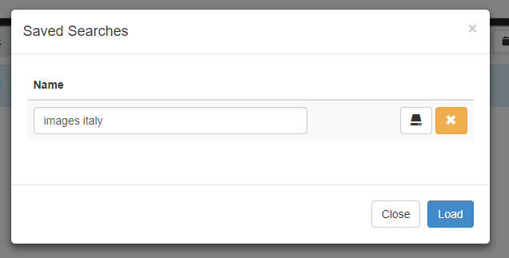

#### Searching

In addition to filtering, a full-text search is provided. This full-text search is based on the Pimcore Backend full-text search and provides the same features in terms of search syntax:

- `*` wildcard
- `+` must contain token
- `-` exclude token
- `" "` exact search of token

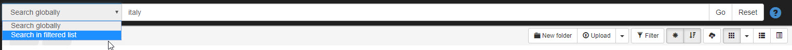

The search has two working modes that can be selected in the drop-down next to the search field:

- *Search globally*: Searches for assets matching the criteria in all assets.
- *Search in filtered list*: Searches for assets matching the criteria in current filter result only.

The search result is shown in the same way as the filter result - all results are grouped by folder. After searching, filters can be applied to the search result to narrow down the results.

#### Sorting

Sorting of the list can be adjusted via the toolbar buttons on the top.

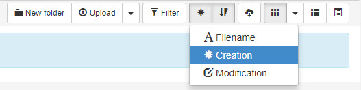

If additional sorting options are needed (e.g. for certain meta data fields), they can be added via the [configuration](#adding-custom-filters)

#### View Modes

You can switch the display of the assets between gallery, details or list mode via the toolbar buttons.

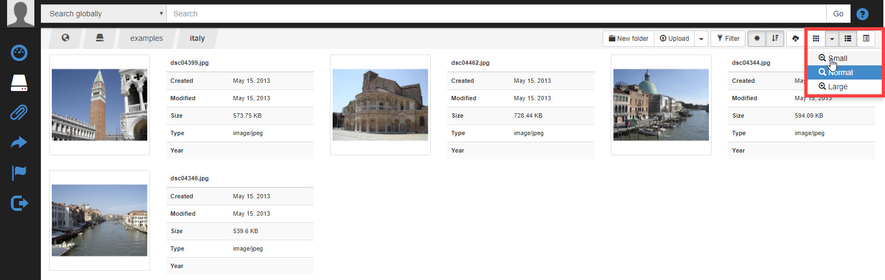

In the detail view, additional metadata fields can be included via the [configuration](#display-asset-meta-fields-in-list).

#### Item Functions

When hovering over an item (folder or asset), several item options are shown (depending on item type and permissions):

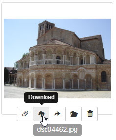

- Assign [collection](#collections) to the item
- Download asset to download the asset directly in list view
- [Share item](#sharing]
- Relocate asset to a different folder. When clicking the button, a folder tree opens to select the new location for the asset.
- Delete the asset.

#### Multi-Selection

When holding `CTRL` key and clicking assets, a multi-selection of assets can be created. Once you select multiple assets, all item functions (see section above) are applied to all selected assets and the additional item function `edit` appears (see next section).

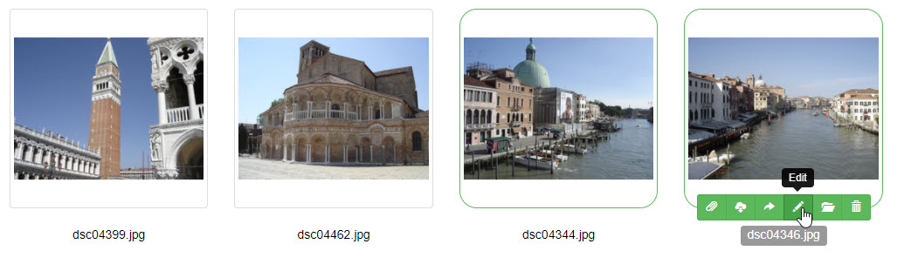

#### Batch Edit

When multiple assets are selected, the item function `edit` appears. It opens a batch dialog for editing multiple assets metadata at once.

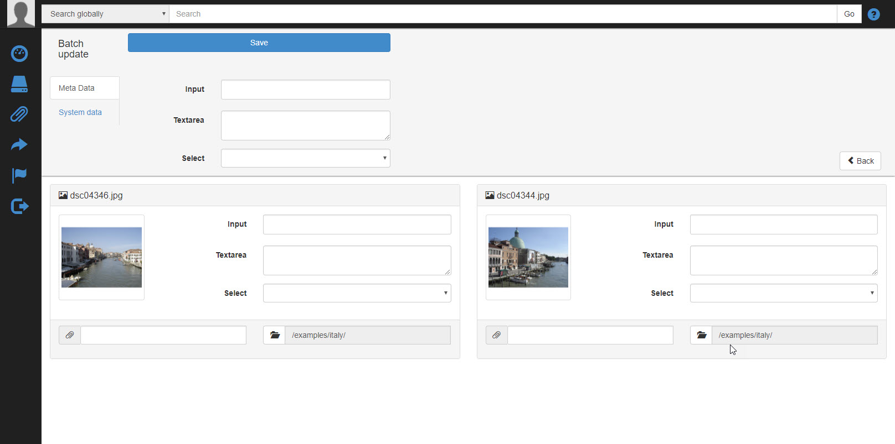

In Addition to editing asset metadata, assigning collections and relocating assets can also be done in batch mode.

### Asset Detail {#asset-detail}

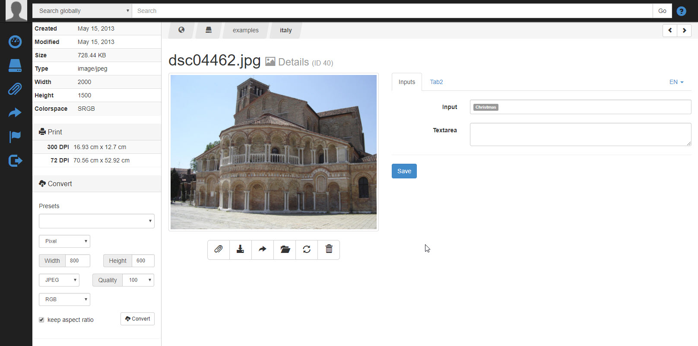

The asset detail page shows all available information related to the selected asset and provides several functions which can be applied to the asset.

#### Visualisation of Meta Data

By default, all available metadata stored for the asset is shown. You can configure the visualization of metadata fields like hiding, setting fields to be required, displaying metadata fields in tabs via [configuration](#asset-meta-data-visualization).

#### Item Functions

Following functions are available via the item function section:

- Assign [collection](#collections) to the item
- Download original asset file
- [Share item](#sharing]
- Relocate asset to a different folder. When clicking the button, a folder tree opens to select the new location for the asset
- Edit asset (only available for images and if [activated](#inline-image-editing))
- Upload new version of the asset (e.g. replace the image with a better quality image)
- Delete the asset

#### System Information

In the top left area the asset's system information like creation or modification date, size, asset type and exif data (if available) get shown.

## Convert and Download Thumbnails

For images, in the bottom left area of the detail page, converting options are available. Converting options (like size or format) can be set manually or an [existing preset](#configure-download-formats) can be used to convert images and download it. 

### Upload assets {#asset-upload}

There are two ways for uploading assets in the list view:

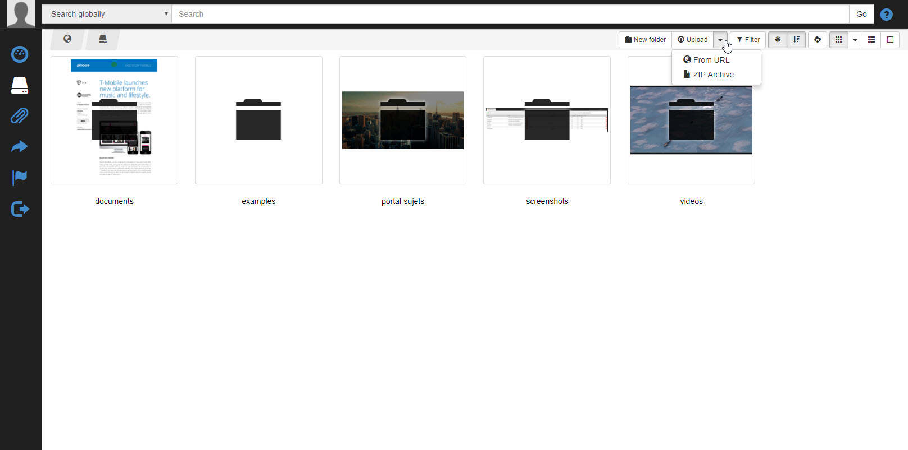
- Via drag & drop to the browser window
- Via the Upload Dialog with the options:
    - Open Upload Dialog (click directly on upload button)
    - Upload from URL
    - Upload and extract ZIP archive

Once the files, which should be uploaded, have been selected, the upload dialog opens.

In this dialog, additional information can be added, which will be stored with the files in the system.

- which metadata fields and collections are available here can be configured

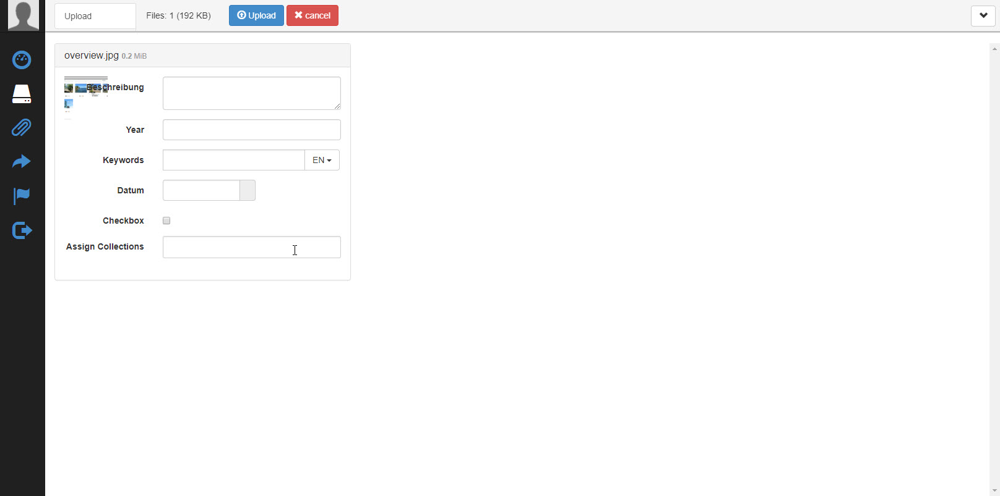

- Batch Assign metadata fields and collections to all uploaded assets at once.

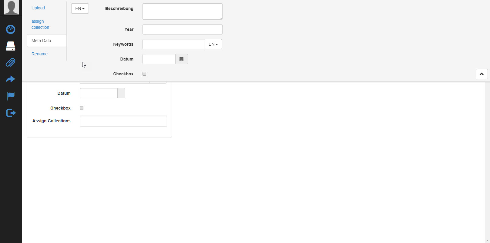

- Rename uploaded files after a certain name scheme.

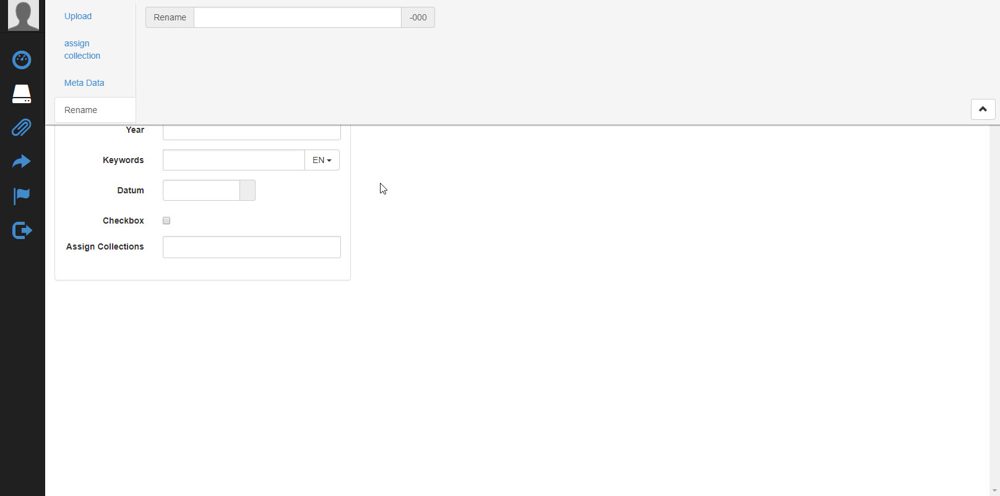

### Collections

The Asset Portal bundle introduces the concept of collections. Collections provide a way to virtually group media assets into categories or topics (e.g. summer products, hotels in the US etc.) and are a way to organize assets in addition to their folder structure.

Collections can be used for filtering and sharing.

#### Create Collections

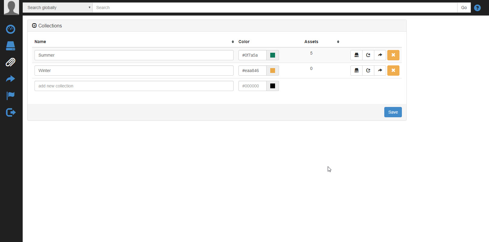

Collections can be created on the collection overview page and by default are visible to the creator only. On the overview page, collections can also be shared, deleted and all assets of a collection can be listed.

#### Assign Assets to Collection

Collections can be assigned to assets at several places in the DAM Frontend:

- [Asset list view](#asset-listing) (batch assigment is possible when multiple assets are selected)
- [Asset detail page](#asset-detail)
- [Asset upload dialog](#asset-upload)

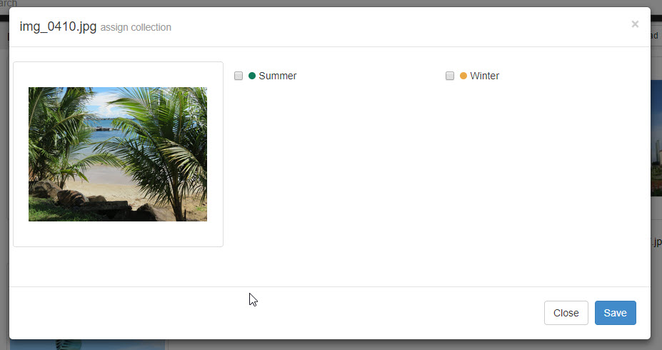

#### Share Collections

There are two ways of sharing collections.

##### Share Collections with Users

By default, collections are only visible to the user who created them. Collections can be shared with other users with the `Share with User` feature, which is accessible on the collection overview page.

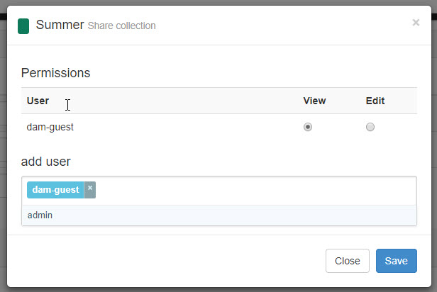

In this dialog the users who have access to the collection can be selected. Two permission levels are available:

- View: Only list the assets of the collection and use the collection for filtering. No editing (like adding and removing assets to the collection) is possible.
- Edit: The user can also add assets to and remove assets from the collection. Changes are visible to all users.

### 2) Share Collections with external users

In addition to sharing collections with other users, they can also be shared with external users.

## Portal Configuration

After installation, the bundle is ready to use. You can change the following configuration options via `/config/packages/config.yaml` (or `app/configc/config.yml` in Pimcore <= 6).

### Permissions

The user management of the bundle is based on Pimcore's user management. This means that the same credentials and permissions are used as for Pimcore backend users. Visibility and permissions (like move, delete or edit) for assets are configurable with standard Pimcore element workspaces. See [Pimcore Docs](https://pimcore.com/docs/pimcore/current/Development_Documentation/Administration_of_Pimcore/Users_and_Roles.html) for details. Role-based permissions are supported.

In addition to that, the portal comes with a few additional permissions to configure access to certain features. These permissions are also configured in the user / role permissions:

- `Asset portal`: Allow access to Portal
- `Asset portal Collection`: Allow access to DAM collections (create new collections, add assets to collections)
- `Asset portal Settings`: DAM settings menu entry in Pimcore Backend (for editing Terms and Conditions)
- `Asset portal Share`: Allows user to create asset shares

### Feature Configuration

Feature Configuration takes place in standard Symfony configuration files(e.g. `/config/packages/config.yaml` (Pimcore >= 10) or `app/configc/config.yml` in Pimcore <= 6). A few features with additional explanation are listed below. You can get a list of all available configurations via `bin/console config:dump-reference BlackbitAssetPortalBundle`.

#### Customize appearance

It is possible to customize the appearance of the portal by injecting custom CSS and JS files by using the configurations `asset_portal.frontend.customize.css`,
`asset_portal.frontend.customize.js`, `asset_portal.backend.customize.css` and
`asset_portal.backend.customize.js`, e.g.
```yaml
asset_portal:
  frontend:
    customize:
      css:
        - /bundles/app/portal/custom.css
      js:
        - /bundles/app/portal/custom.js
```

#### Frontend Translation

Translations are based on the user's language, all translations are located in Pimcore Shared Translations. So it is possible to adapt certain translations if needed.

Depending on your localizaton settings the user language might not be available in `Shared Translations` (e.g Pimcore user language is `en`, in shared translations there is only `en_GB`, `en_US`, etc. available. To map the languages use the `pimcore_dam.backend.languageMapping` configuration.

```yaml
asset_portal:
  backend:
    languageMapping:
      en_GB: en
```

#### Display Asset Meta Data fields in list view {#display-asset-meta-fields-in-list}

It is possible to display asset meta data in the asset list view. Use the configuration
`asset_portal.backend.ui.listview.listview_metadata` to provide a list of meta data to be shown:
```yaml
asset_portal:
  backend:
    ui:
      listview:
        listview_metadata: ['sku']
```

#### Configure Sort Options of list view

With the configuration `pimcore_dam.backend.ui.listview.sort` the default options for sorting the list view can be overwritten.

#### Add Custom Items to Sidebar Menu

It is possible to add custom items to the sidebar menu in the left. To do so use the
`asset_portal.backend.ui.sidebar` setting.

```yaml
asset_portal:
  backend:
    ui:
      sidebar:
        # Add additional items to menu
        item:
            -
                # Permission to restrict the menu item to
                permission: 'export_bmecat'
                # Route name for link of menu item
                route: 'export_bmecat'
                # CSS class for icon
                menuIcon:             ~
                # Tooltip text for menu item
                menuName: 'Export products BMEcat'
```

#### Public Access User

By default, access to the portal is only allowed for valid Pimcore users. Additionally, there is an option to allow access for guests. To configure the permissions for this public access, a mapping to a certain Pimcore user is necessary. This
is configured with the `asset_portal.backend.user.guest` option. When set, the public access is enabled and public access users have the permissions of this user.

```yaml
asset_portal:
  backend:
    user: 'dam-guest'
```

#### Asset Meta Data Visualization {#asset-meta-data-visualization}

For the asset detail page, it is possible to configure the appearance of the asset meta data. Things like hidden asset meta data (`asset_portal.backend.metadata.hidden`), read only fields
(`asset_portal.backend.metadata.readonly`), custom tabs (`asset_portal.backend.metadata.group`), required fields (`asset_portal.backend.metadata.required`) and custom dropdowns to fill input fields (`asset_portal.backend.metadata.selectable`) can be configured.

#### Hide Users for Collection Sharing

Collections can be shared with other users. By default, all users which have access to the portal are listed in the share dialog. To hide certain users (e.g. admin users) from this dialog use the `asset_portal.backend.collection.share.user.hide` configuration.

#### Adding Custom Filters {#adding-custom-filters}

The DAM Frontend ships with a couple of filters to filter assets in the list view. To add additional filters use the `asset_portal.filters` configuration.

#### Enable Inline Image Editing {#inline-image-editing}

An inline Image Editor (the same as in the Pimcore backend) can be activated for the asset detail page with the
`asset_portal.extension.imageEditor.enabled` configuration.

#### Terms Accept Dialog in Share Frontend

To configure the terms accept dialog in the Share Frontend use the
`asset_portal.extension.shareAcceptTerms.*` configuration.

#### Configure Download Formats {#configure-download-formats}

It is possible to preconfigure available download formats for image and video assets. These are configured in `asset_portal.download.*`. 

## Dynamic Configuration

In addition to the static YAML configuration it is possible to override permissions based on events listeners. By doing so, the application can add/remove permissions, such as the download feature, based on asset metadata or complex user permissions.

## Example 1: Hide/Remove Download Functionality

```php
class AssetPortalListener implements EventSubscriberInterface
{
    public static function getSubscribedEvents()
    {
        return [
            Events::ITEM_RIGHTS => 'itemRights',
        ];
    }

    public function itemRights(\Pimcore\Bundle\DamBundle\Event\ItemRights $e) {
         if ($asset = $e->getItem()->getAsset()) {
            if ($asset->getMetadata("fileNotDownloadable")) {
                $e->setAllowDownload(false);
            }
        }
    }
}
```

## Example 2: Metadata Change Hook

By overriding the `pimcore_dam.metadata_change.hook` service it is possible to dynamically change the permissions for editable metadata fields (portal detail page, batch assignment view).

In your config.yaml you have to override the service:

```yml
services:
    pimcore_dam.permissions.hook:
        class:  AppBundle\Service\Asset\Dam\MetadataChangeHook
```

And then implement your custom logic:
```php

class MetadataChangeHook extends DefaultMetadataChangeHook
{
    public function getReadOnlyFields(AbstractItem $item = null, array $readOnlyFields) : array {
        $inPhotographerHomeDir = strpos($item->getAsset(), '/dam/photographer/') === 0;
      
        $editableFields = [];
        if ($this->getUser()->isAdmin() || $this->getAsset->getUserOwner()->getId() === $this->getUser()->getId()) {
            $editableFields[] = 'photographer_name';
            $editableFields[] = 'location';
        }

        $diff = array_diff($readOnlyList, $editableFields); //remove editable fields from readonly list

        return $diff;
    }
}
```


